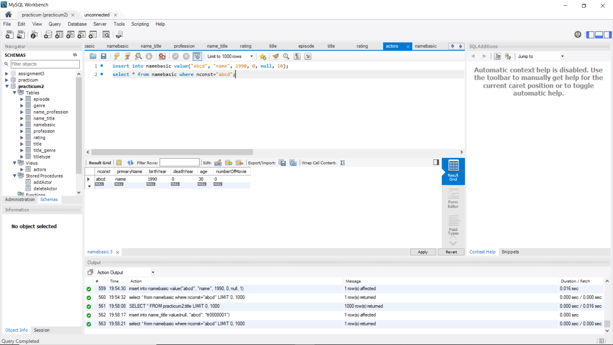

Install needed package
```{r}
if (!require("RMySQL")) install.packages("RMySQL")
if (!require("splitstackshape")) install.packages("splitstackshape")
```

# Practicum 2
Due to the time consuming issue I only import 100,100 rows here. All of the following functionality are tested to be able to scale to any number of rows. If you want to test all data feel free to change nrows.
```{r}
testNames <- read.csv(file = "name.basics.tsv.gz", sep = '\t', header = TRUE, nrows = 10000)
testNames
```


```{r}
testTitle <- read.csv(file="title.basics.tsv.gz", sep = '\t', header = TRUE, stringsAsFactors = FALSE, nrows = 100000)
testTitle
```

```{r}
testEpisode <- read.csv(file="title.episode.tsv.gz", sep = '\t', header = TRUE, fill = TRUE, nrow = 10000)
testEpisode
```

```{r}
testRating <- read.csv(file="title.ratings.tsv.gz", sep = '\t', header = TRUE, stringsAsFactors = FALSE, nrow = 10000)
testRating
```

# 2. ERD diagram
**A. Tool used**
Used LucidaChart to create.\
**B. Places modified**
Added many-to-many associate table between title and names. normalized multi-valued attributes of generes, professions, and knowForTitle. Created lookup table for title type.\
**C. Attribute added**
Added age and number of movies to Name Table.\
**D. In at least BCNF **
Attributes in single value. No functional dependency between non-primray key attribute. All attributes only functional dependent on primary key. No redundency based on functional dependency.\


# Connect to MySQL
```{r}
library(RMySQL)
db_user <- 'root'
db_password <- 'xxx'
db_name <- 'practicum2'
db_host <- 'localhost' # for local access
db_port <- 3306

# 3. Read data from db
mydb <-  dbConnect(MySQL(), user = db_user, password = db_password,
                 dbname = db_name, host = db_host, port = db_port)

```


# 3. Create tables
```{r}
createTitleType <- "
create table if not EXISTS TitleType (
	tType varchar(360) primary key
);"

createTitle <- "
CREATE TABLE if not EXISTS Title (
	tconst varchar(360) primary key,
    titleType varchar(360),
    primaryTitle varchar(360),
    originalTitle varchar(360),
    isAdult boolean,
    startYear int(4),
    endYear int(4),
    runtimeMinutes int,
    foreign key (titleType) references TitleType(tType) 
);"

createGenre <- "
create table if not EXISTS Genre (
	genre varchar(360) primary key
);
"
createTitle_Generes <- "
create table if not EXISTS Title_Genre (
	tgId int primary key auto_increment,
    tconst varchar(360),
    genre varchar(360),
    foreign key (tconst) references Title(tconst) on delete cascade on update cascade,
	foreign key (genre) references Genre(genre) on delete cascade on update cascade
);
"

createEpisode <-"
create table if not EXISTS Episode (
	tconst varchar(360) primary key,
    parentTconst varchar(360),
    seasonNumber int,
    episodeNumber int,
    foreign key (parentTconst) references Title(tconst) on delete cascade on update cascade
);"

createRating <-"
create table if not EXISTS Rating (
	tconst varchar(360) primary key,
    averageRating float(2),
    numVotes bigint,
    foreign key (tconst) references Title(tconst) on delete cascade on update cascade
);
"

createNameBasic <- "
create table if not EXISTS NameBasic (
	nconst varchar(360) primary key,
    primaryName varchar(360) not null,
    birthYear int default 0,
    deathYear int default 0,
    age int default 0,
    numberOfMovie int default 0
);
"

createKnownForTitle <- "
create table if not EXISTS Name_Title (
	ntId int primary key auto_increment,
    nconst varchar(360),
    tconst varchar(360),
    foreign key (tconst) references Title(tconst),
    foreign key (nconst) references NameBasic(nconst)
);"

createProfession <- "
create table if not EXISTS Profession (
	profession varchar(360) primary key
);"

createName_Profession <-"
create table if not EXISTS Name_Profession (
	npid int primary key auto_increment,
    nconst varchar(360),
    profession varchar(360),
    foreign key (profession) references Profession(profession) on delete cascade on update cascade,
    foreign key (nconst) references NameBasic(nconst) on delete restrict on update cascade
);"

dbSendQuery(mydb, createTitleType)
dbSendQuery(mydb, createTitle)
dbSendQuery(mydb, createGenre)
dbSendQuery(mydb, createEpisode)
dbSendQuery(mydb, createRating)
dbSendQuery(mydb, createNameBasic)
dbSendQuery(mydb, createKnownForTitle)
dbSendQuery(mydb, createProfession)
dbSendQuery(mydb, createName_Profession)

res <- dbSendQuery(mydb, "SELECT * FROM information_schema.columns WHERE table_schema = 'practicum2';")
res <- fetch(res, n=-1)
res
```

# 4. Insert Data to Mysql
**Referential Integraty:** When insert datat that requires foreign key constrainst. Data insertion will fail if the inserted foreign key does not exisists in reference table. Therefore Before insertion we need to check that the foreign key does exsists.\
**Solution:** Loop through all data before insert to make sure that all the referencing keys are in the referenced table otherwise only the rows that pass referential integraty will be inserted. This requires a lot of time to acheive.\

TitleType table
```{r}
#Get all titleType
tType <- testTitle[,"titleType"]
tType <- unique(tType)
tType <- data.frame(tType)

dbWriteTable(mydb, value = tType, name="titletype", append = TRUE, row.names = FALSE)
res <- dbSendQuery(mydb, "select * from titletype;")
res <- fetch(res, n=-1)
res
```
Title Table
```{r}
#Remove unnecessary colunms
titles <- testTitle[, !(names(testTitle) %in% "genres")]

titles[titles == "\\N"] <- ""

dbWriteTable(mydb, value = titles, name="title", append = TRUE, row.names = FALSE)
res <- dbSendQuery(mydb, "select * from title;")
res <- fetch(res, n=-1)
res
```
Genre Table
```{r}
#Get all genre type
genres <- as.vector(testTitle[, "genres"])
genres <- unlist(strsplit(genres, ","))
genres <- unique(genres)
genre <- genres[!(genres %in% "\\N")]

genres <- data.frame(genre)

#Write to DB
dbWriteTable(mydb, value = genres, name = "genre", append = TRUE, row.names = FALSE)

res <- dbSendQuery(mydb, "select * from genre;")
res <- fetch(res, n=-1)
res

```
Title_Genre table
```{r}
#Make genres single valued
library(splitstackshape)
keep <- c("tconst", "genres")
titleG <- testTitle[keep]
titleG <- cSplit(titleG, splitCols=2, sep = ",", direction = "long")[!is.na(genres)]
colnames(titleG) <- c("tconst", "genre")
titleG$tgId <- seq.int(nrow(titleG))
titleG <- titleG[,c(3, 1:2)]

#Write to DB
dbWriteTable(mydb, value = titleG, name = "title_genre", append = TRUE, row.names = FALSE)
res <- dbSendQuery(mydb, "select * from title_genre;")
res <- fetch(res, n=-1)
res
```
Episode Table
```{r}
#need to clear foreign key

testEpisode[testEpisode == "\\N"] <- ""

#Write to DB
dbWriteTable(mydb, value = testEpisode, name = "episode", append = TRUE, row.names = FALSE)
res <- dbSendQuery(mydb, "select * from episode;")
res <- fetch(res, n=-1)
res
```
Rating Table
```{r}
#Write to DB
dbWriteTable(mydb, value = testRating, name = "rating", append = TRUE, row.names = FALSE)
res <- dbSendQuery(mydb, "select * from rating;")
res <- fetch(res, n=-1)
res
```
NameBasic Table
```{r}
#Drop unecessray column and \\n
drops <- c("primaryProfession", "knownForTitles")
testNames1 <- testNames[ , !(names(testNames) %in% drops)]
testNames1[testNames1 == "\\N"] <- "" 

#Write to DB
dbWriteTable(mydb, value = testNames1, name = "namebasic", append = TRUE, row.names = FALSE)
res <- dbSendQuery(mydb, "select * from namebasic;")
res <- fetch(res, n=-1)
res
```
Name_Title
```{r}
#Create Many-to-Many relationship
library(splitstackshape)
keep <- c("nconst", "knownForTitles")
nameTitle <- testNames[keep]
nameTitle <- cSplit(nameTitle, splitCols=2, sep = ",", direction = "long")[!is.na(knownForTitles)]
colnames(nameTitle) <- c("nconst", "tconst")
nameTitle$ntId <- seq.int(nrow(nameTitle))
nameTitle <- nameTitle[,c(3, 1:2)]

#Write to DB
dbWriteTable(mydb, value = nameTitle, name = "name_title", append = TRUE, row.names = FALSE)
res <- dbSendQuery(mydb, "select * from name_title;")
res <- fetch(res, n=-1)
res

```

Profession Table
```{r}
#Get all professions
profession <- as.vector(testNames[, "primaryProfession"])
profession <- unlist(strsplit(profession, ","))
profession <- unique(profession)

profession <- data.frame(profession)

#Write to DB
dbWriteTable(mydb, value = profession, name = "profession", append = TRUE, row.names = FALSE)
res <- dbSendQuery(mydb, "select * from profession;")
res <- fetch(res, n=-1)
res
```
Name_Profession Table
```{r}
#Create many-to-many relationship
library(splitstackshape)
keep <- c("nconst", "primaryProfession")
nameProfession <- testNames[keep]
nameProfession <- cSplit(nameProfession, splitCols=2, sep = ",", direction = "long")[!is.na(primaryProfession)]
colnames(nameProfession) <- c("nconst", "profession")
nameProfession$npId <- seq.int(nrow(nameProfession))
nameProfession <- nameProfession[,c(3, 1:2)]

#Write to DB
dbWriteTable(mydb, value = nameProfession, name = "name_profession", append = TRUE, row.names = FALSE)
res <- dbSendQuery(mydb, "select * from name_profession;")
res <- fetch(res, n=-1)
res
```

# 5. Update
Number of moie is defined by find all Known for title (all series filmed) and only keep series which titleType are movie.
```{r}
#fetch from database
nameFromDB <- dbSendQuery(mydb, "select * from namebasic;")
nameFromDB <- fetch(nameFromDB, n=-1)
titleFromDB <- dbSendQuery(mydb, "select * from title;")
titleFromDB <- fetch(titleFromDB, n=-1)

#find age and number of movie
movieNum <- merge(nameTitle, testTitle, by="tconst")
movieNum <- movieNum[movieNum$titleType == "movie"]
year <- format(Sys.Date(), "%Y")
year <- as.numeric(year)

for (i in 1:nrow(nameFromDB)) {
  temp <- nameFromDB[i,]
  count <- nrow(movieNum[movieNum$nconst == temp$nconst,])
  temp$numberOfMovie <- count
  if(temp$birthYear == 0 ){ temp$age <- 0 }
  else if(temp$deathYear == 0) {
    temp$age <- year-temp$birthYear
  }else{
    temp$age <- temp$deathYear-temp$birthYear
  }
#update database
  query <- paste0("update namebasic set age= ", temp$age, ", numberOfMovie = ", temp$numberOfMovie, " where nconst = '", temp$nconst, "';")
  dbSendQuery(mydb, query)
}
res <- dbSendQuery(mydb, "select * from namebasic;")
res <- fetch(res, n=-1)
res
```

## Notice: Since delimiters are not allowed in dbsendquery, they are eliminated in the following trigger and stored procedure queries. Thus the notebook can compile properly. In the acutaly MySQL delimiters are needed.

# 6. Trigger
insert to actor will not affect number of movie since it is a value realted to link table with title, which should not be modified if no new associate movie is inserted. Number of movie will only increase when linked product is a titleType of movie.
```{r}
ageTrigger <- "
CREATE TRIGGER insertActorAge
before INSERT
ON namebasic FOR EACH ROW
BEGIN    
	if new.birthYear !=0 then
		if new.deathYear = 0 then set new.age = year(curdate()) - new.birthYear; End if;
		if new.deathYear != 0 then set new.age = new.deathYear - new.birthYear; end if;
	end if;
	set new.numberOfMovie = 0;
END;"

movieCountTrigger <- "

CREATE TRIGGER insertActorMovie
after INSERT
ON name_title FOR EACH ROW
BEGIN
	if (select titleType from title where title.tconst = new.tconst) = 'movie' then
	update namebasic set numberOfMovie = numberOfMovie+1 where new.nconst = namebasic.nconst;
    end if;
END;
"

#send query to db
dbSendQuery(mydb, ageTrigger)
dbSendQuery(mydb, movieCountTrigger)

```



# 7. View
```{r}
actorView <- "
CREATE VIEW actors AS
    SELECT 
        primaryName, age, if (deathYear !=0, 'alive', 'dead') as isAlive, numberOfMovie 
    FROM
        namebasic;"

#send query to db
dbSendQuery(mydb, actorView)
```


# 8. Season Number
I created two different queries. First one will select the max season number as season numeber for a serie this query run way faster than the second one. However, some season number is empty or not labeled by numbe. For example national geographic special labledd season by year so, the first query will omit them therefore I created second query to count each unique season. The second query takes a lot more time to run.
```{r}
seasonNum <- "
SELECT max(seasonNumber) as seasonNum, primaryTitle FROM practicum2.episode as e join title as t on e.parentTconst = t.tconst group by primaryTitle;"

seasonNum2 <- "
SELECT count(distinct seasonNumber) as seasonNum, primaryTitle FROM practicum2.episode as e join title as t on e.parentTconst = t.tconst group by primaryTitle;
"

#send query to db
seasonNumRes <- dbSendQuery(mydb, seasonNum)
seasonNumRes <- fetch(seasonNumRes, n=-1)
seasonNumRes <- seasonNumRes[seasonNumRes$seasonNum <40, ]

hist(seasonNumRes$seasonNum, breaks = seq(0,40,1), xlab = "season Number")
```

# 9.Add Actor
Used transaction to make sure data finishes in one transaction
```{r}
addActor <- "


CREATE PROCEDURE addActor(
	in nconst VARCHAR(360),
    in primaryName varchar(360),
	in birthYear int,
	in deathYear int,
    in profession varchar(360),
    in knownForTitle varchar(360)
)
BEGIN

	DECLARE errno INT;
	DECLARE EXIT HANDLER FOR SQLEXCEPTION
    BEGIN
    GET CURRENT DIAGNOSTICS CONDITION 1 errno = MYSQL_ERRNO;
    SELECT errno AS MYSQL_ERROR;
    ROLLBACK;
    END;
    
    start transaction;
    
	insert into namebasic value(nconst, primaryName, birthYear, deathYear, 0, 0);
    if profession is not null then
		if (select count(*) from profession as p where p.profession = profession) = 0
			then insert into profession value(profession); end if;
    insert into name_profession value(null, nconst, profession);
    end if;
    if knownForTitle is not null then
    insert into name_title value(null, nconst, knownForTitle);
    end if;
    
    commit work;
END;
"

#send query to db
dbSendQuery(mydb, addActor)
```


# 10. Delete Actor
```{r}
deleteActor <- "


CREATE PROCEDURE deleteActor(
	in nconst VARCHAR(360)
)
BEGIN

	DECLARE errno INT;
	DECLARE EXIT HANDLER FOR SQLEXCEPTION
    BEGIN
    GET CURRENT DIAGNOSTICS CONDITION 1 errno = MYSQL_ERRNO;
    SELECT errno AS MYSQL_ERROR;
    ROLLBACK;
    END;
    
    start transaction;
		delete from name_profession where name_profession.nconst = nconst;
		delete from name_title where name_title.nconst = nconst;
		delete from namebasic where namebasic.nconst = nconst;
    commit work;
END;"

#send query to db
dbSendQuery(mydb, deleteActor)
```


# 11. Find actors that have more than 2 movies above average rating
Used two version\
groupBy: count all the occurence of movies above avarage rating (slow)\
whereClause: utilized numberOfMoive column, should be use if the data is ensured to be correct (fast)
```{r}
groupBy <- "
select primaryName, age from namebasic as nb join name_title as nt on nb.nconst = nt.nconst
	join title as t on t.tconst = nt.tconst join rating as r on r.tconst = t.tconst where t.titleType = 'movie' and averageRating > (select avg(averageRating) from rating) group by nb.nconst having count(nb.nconst) > 2;
"

whereClause <- "
select distinct primaryName, age from namebasic as nb join name_title as nt on nb.nconst = nt.nconst
	join title as t on t.tconst = nt.tconst join rating as r on r.tconst = t.tconst where titleType = 'movie' and averageRating > (select avg(averageRating) from rating) and numberOfMovie>2;"

#send query to db
actor1Res <- dbSendQuery(mydb, groupBy)
actor1Res <- fetch(actor1Res, n=-1)
actor1Res
actor2Res <- dbSendQuery(mydb, whereClause)
actor2Res <- fetch(actor2Res, n=-1)
actor2Res
```

# 12. Index performance
The reason that select is faster with index is that after creating index it creates a sorted b tree which reduce the look up time to approximately Theta(1). Depending on how the tree structed. It may need more look up which still reduce time significantly probably to O(logN).
```{r}
#create index
dbSendQuery(mydb, "create index primaryName on namebasic (primaryName);")

#timer
start.time <- Sys.time()
query2 <- dbSendQuery(mydb, "SELECT * FROM practicum2.namebasic where primaryName = 'James L. Brooks';
")
end.time <- Sys.time()
query2 <- fetch(query2, n=-1)
time2 <- end.time - start.time

#drop index
dbSendQuery(mydb, "DROP INDEX primaryName ON namebasic;")
start.time <- Sys.time()
query1 <- dbSendQuery(mydb, "SELECT * FROM practicum2.namebasic where primaryName = 'James L. Brooks';
")
end.time <- Sys.time()
query1 <- fetch(query1, n=-1)
time1 <- end.time - start.time

time1 <- as.numeric(time1)
time2 <- as.numeric(time2)

h <- c(time1, time2)
barplot(h, names.arg = c("without index", "with index"), ylab = "time in sec")
```

# 13. Index with insertion
Since after index created it will keep an sorted B-tree. Therefore, everytime the insersion happens, the inserted row needs to be in the correct posisiton which means B-tree needs to be checked for its invariance. Therefore, more index means more B-tree means more verification or restructure time.
```{r}
#create index1
dbSendQuery(mydb, "create index startYear on title(startYear);")

#timer
start.time <- Sys.time()
query1 <- dbSendQuery(mydb, "insert into title value('tt9000000', 'short', 'safa', 'sdafb', 0, 2000, 0, 100);
")
end.time <- Sys.time()
time1 <- end.time - start.time

#create index2
dbSendQuery(mydb, "create index primaryTitle  on title(primaryTitle);")

#timer
start.time <- Sys.time()
query2 <- dbSendQuery(mydb, "insert into title value('tt9000001', 'short', 'safa', 'sdafb', 0, 2000, 0, 100);
")
end.time <- Sys.time()
time2 <- end.time - start.time

#create index3
dbSendQuery(mydb, "create index originalTitle on title(originalTitle);")

#timer
start.time <- Sys.time()
query3 <- dbSendQuery(mydb, "insert into title value('tt9000003', 'short', 'safa', 'sdafb', 0, 2000, 0, 100);
")
end.time <- Sys.time()
time3 <- end.time - start.time


#without index
dbSendQuery(mydb, "drop index startYear on title;")
dbSendQuery(mydb, "drop index primaryTitle on title;")
dbSendQuery(mydb, "drop index originalTitle on title;")

#timer
start.time <- Sys.time()
query4 <- dbSendQuery(mydb, "insert into title value('tt9000004', 'short', 'safa', 'sdafb', 0, 2000, 0, 100);
")
end.time <- Sys.time()
time4 <- end.time - start.time

h <- c(as.numeric(time4), as.numeric(time1),as.numeric(time2), as.numeric(time3))
x <- c(0,1,2,3)
plot(x, h, type = "o", ylab = "excution time in sec", xaxt='n')
axis(1,at=c(0,1,2,3),labels=c( "no index", "1 index", "2 index", "3 index"))

```


```{r}
dbClearResult(dbListResults(mydb)[[1]])
```

# Disconnect MySQL
```{r}
on.exit(dbDisconnect(mydb))
```

